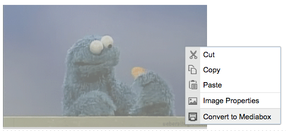

# ckeditor-mediaboxconvert

> Easily convert your images and iframe-insulator embeds into Mediabox widgets.

This plugin adds a contextMenu to your editor pane, quickly converting your images or [iframe-insulator](https://github.com/radiovisual/ckeditor-iframeinsulator.git) embeds into [Mediabox](https://github.com/radiovisual/ckeditor-mediabox.git) widgets.
 
## Installation

**Step 1:** Install the [ckeditor-mediabox plugin](https://github.com/radiovisual/ckeditor-mediabox.git)
 
**Step 2:** Copy the `mediaboxconvert` plugin directory to your CKEditor's plugin folder:
```
ckeditor/plugins/
```

**Step 3:** Add the plugin to the CKEDITOR configuration:
```js
CKEDITOR.config.extraPlugins = 'mediaboxconvert';
```

**Step 4:** Ensure that this plugin can create content:
```js
CKEDITOR.config.allowedContent = true;
```

**Step 5:** For best results, disable the default `iframe` plugin and use [iframe-insulator](https://github.com/radiovisual/ckeditor-iframeinsulator.git):
```js
CKEDITOR.config.removePlugins = 'iframe';
```

## Usage

Once installed, you will now get a new contextMenu item: `Convert to Mediabox`



This will simply convert the image or [iframe-insulator](https://github.com/radiovisual/ckeditor-iframeinsulator.git) embed into a [Mediabox Widget](https://github.com/radiovisual/ckeditor-mediabox.git).  

## License

MIT @ [Michael Wuergler](http://numetriclabs.com)
